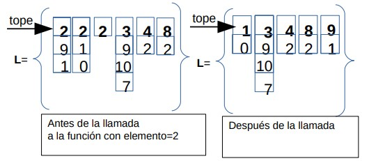
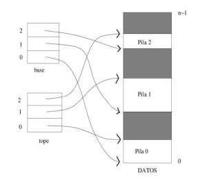

# RETO 3 - ESTRUCTURA DE DATOS

## Ejercicios

1. Dada una lista que contiene pilas con enteros y que se encuentra ordenada de
menor a mayor por el tope de cada pila, Implementar una función borrar, que
elimina el tope de cada pila en la lista, con valores iguales al dado como parámetro.
La cabecera de la función sería:
 ~~~
void Borrar(list<stack<int> > & L, int elemento);
~~~

[Código de  este ejercicio.](./ejercicio1/src/main.cpp)

2. Se pretende almacenar k pilas en un único vector utilizando la estructura de datos sugerida
   en la figura siguiente (para el caso k=3). Implementa las funciones **push** y **pop** que
   insertan/borran un determinado entero en una de las pilas.

Código de este ejercicio:
1. Clase VectoPilas:
   1. [Especificación](./ejercicio2/includes/VectorPilas.h)
   2. [Implementación](./ejercicio2/src/VectorPilas.cpp)
2. [Ejemplo de  uso](./ejercicio2/src/main.cpp)
